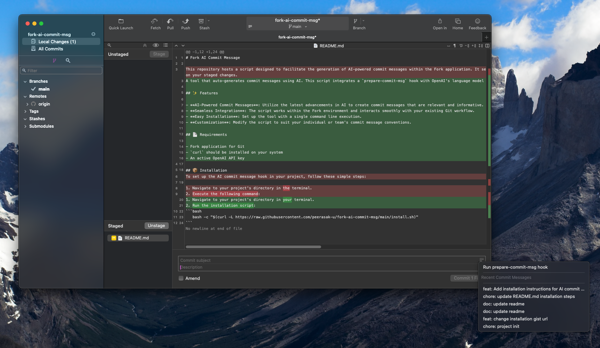

# Fork AI Commit Message



A tool that auto-generates commit messages using AI. This script integrates a `prepare-commit-msg` hook with OpenAI's language model to provide you with smart, context-aware commit suggestions.

## ✨ Features

- **AI-Powered Commit Messages**: Utilize the latest advancements in AI to create commit messages that are relevant and informative.
- **Seamless Integration**: The script works within the Fork environment and interacts smoothly with your existing Git workflow.
- **Easy Installation**: Set up the tool with a single command line execution.
- **Customization**: Modify the script to suit your individual or team's commit message conventions.

## 📄 Requirements

- [Fork](https://git-fork.com) application for Git
- `curl` and `jq` should be installed on your system
- An active [OpenAI API key](https://platform.openai.com/account/api-keys)

## 📦 Installation

1. Navigate to your project's directory in your terminal.
2. Run the installation script:
```bash
bash -c "$(curl -L https://raw.githubusercontent.com/peerasak-u/fork-ai-commit-msg/main/install.sh)"
```

## 🚀 Usage
1. Go to "Local Change" menu in Fork
2. Click on "Run prepare-commit-msg hook"